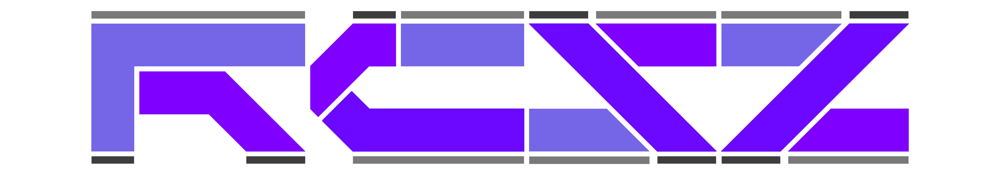

<h1 align="center">👋 Hi I'm RCSZ</h1>

  
  

<strong> Stay hungry. Stay foolish. - Steve Jobs </strong>

__2024-2025__
## 🐠 编程
> - 经常使用C++17但是很菜
> - Golang初学者 (菜就不用说了)
> - 图形学&并行计算 (偶尔写一下后端

当前维护项目: [StarryPCA](https://github.com/rcszc/StarryPCA)

## 😆 航模无副翼直升机爱好者
> - 喜欢和朋友户外飞行
> - 享受直升机独特的声浪和暴力美学

## 😐 在校创业大学生
> - 和同校朋友们一起创业
> - 在这个"内卷"的时代下我们努力寻找机会

## 😄 其他爱好
> - FURRY
> - 航模固定翼(上单翼&中单翼3D)
> - 高原风景摄影调色剪辑
---

可以来找我 倾诉&聊天&本地可以线下约飞航模, 如果与人交流最基本的情商都没有那只能当xx处理了...
> QQ: 2167163728
